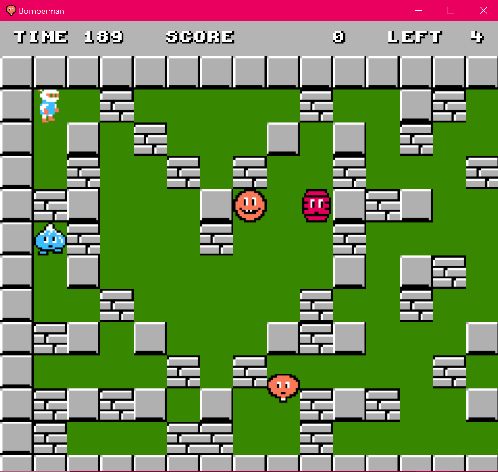
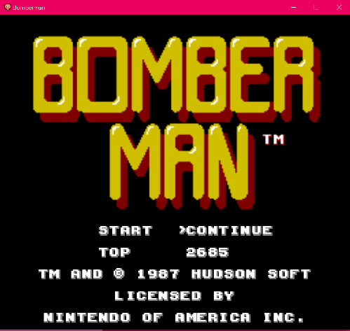
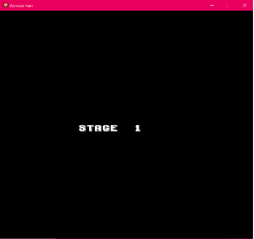
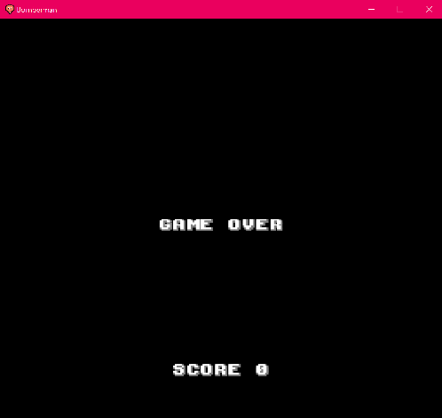
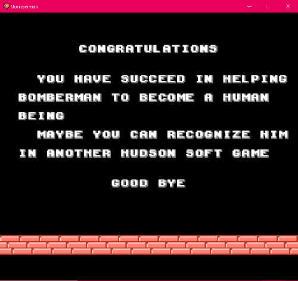
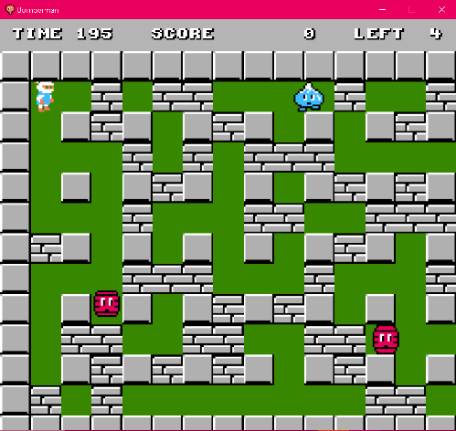

# Bài tập lớn OOP - Bomberman Game
INT2204 21 N3

Đinh Văn Ninh - 21020362

Nguyễn Ngọc Linh - 21020774

Mô phỏng lại trò chơi [Bomberman](https://www.youtube.com/watch?v=mKIOVwqgSXM) kinh điển của NES.

### Game có 5 level, độ khó tăng dần theo số level
- Game có thể chơi từ đầu(START), hoặc tiếp tục màn chơi cũ(CONTINUE), lịch sử điểm chơi cao nhất thể hiện ở TOP
- 
- Chuyển giao giữa của level
- 
- Kết thúc game thắng hoặc thua
- 
- 
### Thanh thể hiện TIME, Số SCORE và LEFT
- 

## Mô tả về các đối tượng trong trò chơi

-  *Bomber* 
-  *Enemy* 
-  *Bomb* 

-  *Grass* 
-  *Wall*
-  *Brick*

-  *Portal* 

Các *Item* cũng được giấu phía sau Brick và chỉ hiện ra khi Brick bị phá hủy. Bomber có thể sử dụng Item bằng cách di chuyển vào vị trí của Item. Thông tin về chức năng của các Item được liệt kê như dưới đây:
-  *SpeedItem* Khi sử dụng Item này, Bomber sẽ được tăng vận tốc di chuyển thêm một giá trị thích hợp
-  *FlameItem* Item này giúp tăng phạm vi ảnh hưởng của Bomb khi nổ (độ dài các Flame lớn hơn)
-  *BombItem* Thông thường, nếu không có đối tượng Bomb nào đang trong trạng thái kích hoạt, Bomber sẽ được đặt và kích hoạt duy nhất một đối tượng Bomb. Item này giúp tăng số lượng Bomb có thể đặt thêm một.

Có nhiều loại Enemy trong Bomberman, tuy nhiên trong phiên bản này chỉ yêu cầu cài đặt hai loại Enemy dưới đây (nếu cài đặt thêm các loại khác sẽ được cộng thêm điểm):
-  *Balloom* 
-  *Oneal* 
-  *Doll* 
-  *Kondoria*  
-  *Minvo* 
-  *Ovape*

## Mô tả game play, xử lý va chạm và xử lý bom nổ
- Trong một màn chơi, Bomber sẽ được người chơi di chuyển, đặt và kích hoạt Bomb với mục tiêu chính là tiêu diệt tất cả Enemy và tìm ra vị trí Portal để có thể qua màn mới
- Bomber sẽ bị giết khi va chạm với Enemy hoặc thuộc phạm vi Bomb nổ. Lúc đấy trò chơi kết thúc.
- Enemy bị tiêu diệt khi thuộc phạm vi Bomb nổ
- Một đối tượng thuộc phạm vi Bomb nổ có nghĩa là đối tượng đó va chạm với một trong các tia lửa được tạo ra tại thời điểm một đối tượng Bomb nổ.

- Khi Bomb nổ, một Flame trung tâm tại vị trí Bomb nổ và bốn Flame tại bốn vị trí ô đơn vị xung quanh vị trí của Bomb xuất hiện theo bốn hướng trên/dưới/trái/phải. Độ dài bốn Flame xung quanh mặc định là 1 đơn vị, được tăng lên khi Bomber sử dụng các FlameItem.
- Khi các Flame xuất hiện, nếu có một đối tượng thuộc loại Brick/Wall nằm trên vị trí một trong các Flame thì độ dài Flame đó sẽ được giảm đi để sao cho Flame chỉ xuất hiện đến vị trí đối tượng Brick/Wall theo hướng xuất hiện. Lúc đó chỉ có đối tượng Brick/Wall bị ảnh hưởng bởi Flame, các đối tượng tiếp theo không bị ảnh hưởng. Còn nếu vật cản Flame là một đối tượng Bomb khác thì đối tượng Bomb đó cũng sẽ nổ ngay lập tức.

